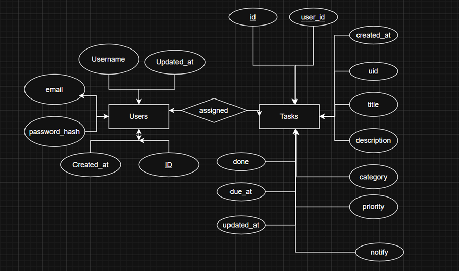
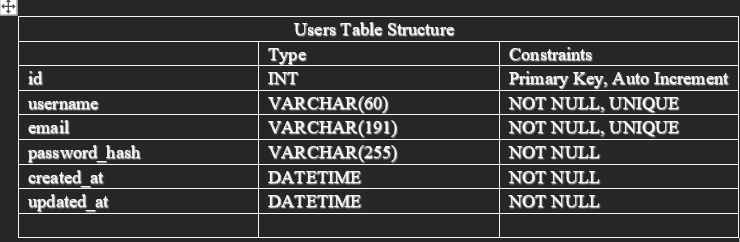
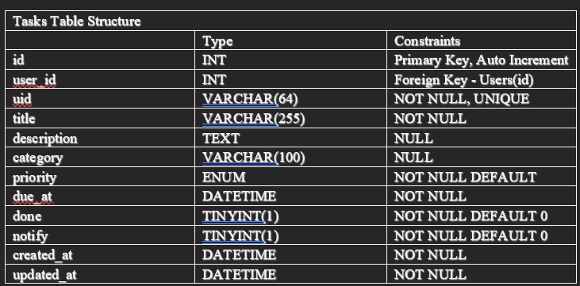

# Student Task Manager - Documentation

## 1. Project Overview
The Student Task Manager is a web-based application that helps students manage and track their academic and personal tasks.  
It allows users to register, log in, create tasks, categorize them, set due dates, mark completion, and view weekly progress through charts.

### Main Features
- User authentication (login/register)
- Create, edit, delete tasks
- Categorize and prioritize tasks
- Task reminders (notify flag)
- Weekly progress visualization (Chart.js)
- Export and import tasks (JSON)

---

## 2. Tech Stack
- Frontend: HTML5, Tailwind CSS, Vanilla JavaScript
- Backend: PHP (direct integration)
- Database: MySQL / MariaDB
- Visualization: Chart.js

---

## 3. System Architecture
High-level flow:
1. Frontend (index.html + app.js): Handles UI, task rendering, and interactions.  
2. Backend (PHP): Handles requests like login, register, create/update/delete tasks.  
3. Database (MySQL): Stores users and tasks.  

## 4. Database Design

### Entity Relationship Diagram (ERD)

### Users Table Structure

### Tasks Table Structure

## 5. Interesting Feature
- Weekly Progress Chart: Built with Chart.js. Shows total tasks vs completed tasks for each day of the current week. Helps students visualize productivity.  
- Task File Import/Export

---

## 6. Setup Instructions
1. Clone the repository from GitHub.  
2. Import `schema.sql` into MySQL.  
3. Configure database credentials in 'server/db.php'.  
4. Start a local server (XAMPP, WAMP, or PHP built-in server).  
5. Open `index.html` in the browser via `localhost`.  

---

## 7. Usage Guide
- Register/Login: Create an account or log in.  
- New Task: Add a task with title, description, due date, category, and priority.  
- Edit/Delete: Update or remove tasks.  
- Filter/Search: Filter by category, priority, completion, or search by title/description.  
- Chart: See weekly distribution of tasks vs completions.  
- Export/Import: Save tasks as JSON or import from a file.  
- Logout: End the session securely.  

---

## 8. Limitations
- Notifications are not real-time (basic reminder flag only).  
- No role-based access (only basic user accounts).  
- Works best on modern browsers.  

---

## 9. Future Improvements
- Add push/email notifications.  
- Mobile app integration.  
- Calendar view (month planner).  
- Group collaboration features.  

---

## 10. References
- Tailwind CSS Documentation  
- Chart.js Documentation  
- PHP + MySQL Tutorials (W3Schools, MDN)  
