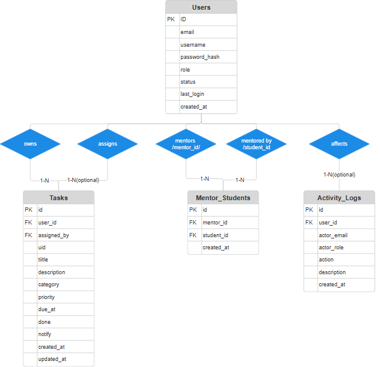

# Student Task Manager - Documentation

## 1. Project Overview
The Student Task Manager is a web-based productivity suite for academic communities. It now supports a tiered experience:
- Students manage their personal workloads.
- Mentors oversee assigned students and create additional tasks.
- A super admin supervises the entire platform, manages roles, and reviews activity logs.

### Main Features
- Session-based authentication with role-aware routing (student, mentor, admin).
- Super admin dashboard for user management, role/status updates, mentor-student linking, and activity auditing.
- Mentor workspace with roster summaries and a guided task assignment modal.
- Student task board with filtering, priority chips, reminders, import/export, and assignment source labels.
- Weekly progress visualization (Chart.js) and due-soon notifications.
- Automatic mentor/student relationship tracking and platform activity logging.

---

## 2. Tech Stack
- Frontend: HTML5, Tailwind CSS, Vanilla JavaScript, Chart.js
- Backend: PHP direct integration (Option B from the server-side requirements)
- Database: MySQL / MariaDB (InnoDB)
- Session management: Native PHP sessions

---

## 3. System Architecture
High-level flow:
1. **Frontend**
   - `index.html` + `assets/app.js`: Student dashboard, task CRUD UI, reminders.
   - `mentor.html` + `assets/mentor.js`: Mentor overview, assignment tooling.
   - `admin.html` + `assets/admin.js`: Super admin panel for governance tasks.
   - `auth.html` + `assets/auth.js`: Authentication entry point with role redirects.
2. **Backend (PHP)**
   - `server/auth.php`: Registration, login, session checks, logout, and super-admin seeding.
   - `server/tasks.php`: Role-aware task CRUD, mentor auto-linking, activity logging.
   - `server/mentor.php`: Mentor/student roster data and summary metrics.
   - `server/admin.php`: User inventory, role/status updates, mentor linking, activity feeds.
   - `server/db.php`: Shared database helpers, lightweight migrations, and logging utilities.
3. **Database**
   - Stores users, tasks, mentor/student mappings, and activity logs. Helper functions ensure schema upgrades on demand.

---

## 4. Database Design

### 4.1 Entities
- **users** (`id`, `email`, `username`, `password_hash`, `role`, `status`, `last_login`, `created_at`)
- **tasks** (`id`, `user_id`, `assigned_by`, `uid`, `title`, `description`, `category`, `priority`, `due_at`, `done`, `notify`, `created_at`, `updated_at`)
- **mentor_students** (`id`, `mentor_id`, `student_id`, `created_at`)
- **activity_logs** (`id`, `user_id`, `actor_email`, `actor_role`, `action`, `description`, `created_at`)

### 4.2 Relationships
- `users (id) 1 -- n tasks (user_id)`  every task belongs to exactly one student owner.
- `users (id) 1 -- n tasks (assigned_by)`  nullable link identifying the mentor/admin who created the task.
- `users (id) 1 -- n mentor_students (mentor_id)`  mentors can supervise many students.
- `users (id) 1 -- n mentor_students (student_id)`  students can have many mentor links, though the current UX treats it as single-mentor.
- `users (id) 1 -- n activity_logs (user_id)`  optional subject of an activity entry.
- `activity_logs.actor_email / actor_role` document the actor even if the user row is later removed.

### 4.3 Design Rationale
The schema separates responsibilities so each concern can evolve independently:
- **users** centralizes authentication and role metadata, enabling role-based routing, suspension, and auditing without duplicating state.
- **tasks** keeps assignment metadata (`assigned_by`) alongside task details so the student board can show the origin of each task and administrators can audit mentor output.
- **mentor_students** is a bridge table that supports many-to-many relationships, future-proofing the platform for group mentorship or co-mentors.
- **activity_logs** provides a write-once trail for compliance, troubleshooting, and future analytics.

This structure minimizes join complexity (each core query touches at most two tables) while keeping the door open for richer reporting.

## 5. Highlighted Enhancements
- **Role-based Dashboards**: Automatic redirection ensures each persona lands on the right workspace after login.
- **Mentor Assignments**: Mentors (and admins) can assign tasks to students directly; the UI tracks who delegated each task.
- **Super Admin Governance**: Centralized controls to activate/suspend accounts, promote mentors, and monitor platform activity.
- **Activity Trail**: Every critical action is appended to `activity_logs`, enabling compliance and troubleshooting.

---

## 6. Setup Instructions
1. Clone or copy the project into your web root (e.g., `htdocs/student-task-manager`).
2. Import or run `schema.sql` to create/upgrade the database. The PHP helpers also apply missing columns at runtime, but seeding the schema up front is faster.
3. Configure database credentials via environment variables (`STM_DB_HOST`, `STM_DB_NAME`, `STM_DB_USER`, `STM_DB_PASS`) or edit `server/config.php` defaults.
4. (Optional) Set super-admin credentials with `STM_ADMIN_EMAIL` / `STM_ADMIN_PASS`; otherwise the fallback is `admin@gmail.com` / `password123`.
5. Start your local server stack (XAMPP).
6. Visit `auth.html` through `http://localhost/...` to log in or register.

---

## 7. Usage Guide
- **Students**
  - Register or sign in, manage tasks from the main dashboard (`index.html`).
  - Tasks display the assigning mentor (when applicable) and support search, filters, import/export, and reminders.
- **Mentors**
  - Use super admin to promote an account to `mentor` once registered.
  - Access `mentor.html` to view student rosters, track open/completed work, and assign new tasks via the modal.
- **Super Admin**
  - Log in with the seeded credentials to reach `admin.html`.
  - Update roles/statuses, link mentors to students, and review the activity log.
- **Sessions**
  - Logout buttons in each workspace clear the PHP session and return to `auth.html`.

---

## 8. Current Limitations
- Email/push notifications are not yet integrated (reminders rely on browser notifications when permitted).
- Activity logs remain within the database; no analytics or export tooling yet.
- Mentor-to-student linking is manual (performed by the super admin or on first mentor assignment) and assumes a one-mentor workflow.
- Documentation diagrams need regeneration to reflect the richer schema.

---

## 9. Future Improvements
- Add notification channels (email/SMS) and escalation policies.
- Provide calendar and Kanban views for mentors/admins.
- Introduce bulk actions for admin (batch role updates, CSV exports).
- Support group mentors, co-mentorship, and optional student self-enrollment flows.
- Harden auditing with filters/search in the activity log UI and downloadable reports.

---

## 11. References
- Tailwind CSS Documentation
- Chart.js Documentation
- PHP Manual 
- MySQL Reference 
